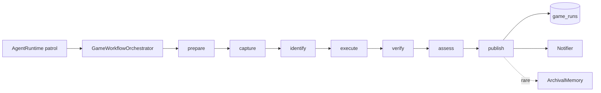

# Game Architecture

游戏自动化采用确定性 workflow。LLM 不接管整局规划,只在 bounded step 内做识别、分类或摘要。

## 1. 现状



每个 game YAML 装配一份 workflow 配置。Orchestrator 串联阶段并通过 `emit_stage_event` 发射结构化事件。

## 2. 分层职责

| 层 | 负责 | 不负责 |
|---|---|---|
| `module.py` | 装配依赖、注册 patrol、暴露 HTTP / IntentSpec | 单步执行细节 |
| `pipeline/orchestrator.py` | 串联七步、发事件、聚合状态 | ADB 命令细节 |
| `pipeline/{prepare,capture,identify,execute,verify,assess,publish}.py` | 单步输入输出与失败语义 | 跨步全局状态 |
| `_connectors/<driver>/` | 设备控制、截图、模板匹配、OCR | 调 LLM、写库、发通知 |
| `games/_schema.py` + YAML | 游戏配置、任务、窗口、风险模板 | 业务控制流 |
| `store.py` | `game_runs` DAL | 任务判断 |

## 3. 七步契约

| 阶段 | 输入 | 输出 | 不变式 |
|---|---|---|---|
| prepare | `GameConfig` + driver | ready / not_ready | ADB 不可达、多设备未指定、包名缺失、游戏不在前台直接失败 |
| capture | driver | `Screenshot` | 截图为空直接失败 |
| identify | screenshot + task + templates | action dict | 模板优先;PR1 未知界面标 `unknown_screen` |
| execute | action + task | `TaskResult` | `dry_run=True` 在真实点击前短路 |
| verify | task result | verified `TaskResult` | 非 dry-run 任务执行后再截图 |
| assess | reward text / OCR | `RewardAssessment` | PR3 接 OCR + classification |
| publish | run result | persisted row + notification | 写 `game_runs`,推摘要,稀有奖励晋升记忆 |

## 4. 数据模型

### 4.1 `game_runs`

| 列 | 类型 | 用途 |
|---|---|---|
| `id` | UUID PK | run id |
| `game_id` | TEXT | YAML id |
| `account_id` | TEXT | 首版固定 `default` |
| `started_at` / `finished_at` | TIMESTAMPTZ | 执行窗口 |
| `status` | TEXT | `success` / `partial` / `failed` / `aborted_risk_control` / `not_ready` |
| `tasks` | JSONB | 每个任务的状态、错误、截图引用 |
| `rewards_summary` | TEXT | 日报一句话 |
| `dry_run` | BOOL | 是否演练 |
| `promoted_to_archival` | BOOL | 是否写入长期记忆 |

## 5. Driver 契约

```text
GameDriver.health() -> {ok, source, ...}
GameDriver.screenshot() -> {ok, source, image_bytes}
GameDriver.find_template(image_bytes, template_path, threshold) -> {ok, source, found, x?, y?, score?}
GameDriver.tap(x, y) -> {ok, source, status}
```

失败字典必须包含 `ok=false`、`source`、`error`、`error_message`。未实现能力用 `status="not_implemented"`。

## 6. LLM 调用

| 调用点 | route | 方法 | 失败行为 |
|---|---|---|---|
| rewards_summary | `generation` | `invoke_text` | 回退 `完成 N/M 个任务` |
| assess_reward | `classification` | `invoke_json` | `rarity=common` |
| unknown screen | `vision` | `invoke_vision_json` | `unknown_screen` |

Vision 输出只能选择 action allowlist,不得输出任意坐标。

## 7. 第一性原理

| 维度 | 分析 | 结论 |
|---|---|---|
| 数据规模 | 单用户每天每游戏 1-2 次 run | `game_runs` 简单 JSONB 足够 |
| 能力归属 | UI 稳定路径适合模板匹配 | 控制流归 workflow |
| 故障域 | 错误点击风险高于漏领一次奖励 | 默认 dry-run,未知界面跳过 |
| 可逆性 | Driver 与 pipeline 解耦 | 未来可替换云游戏 driver |
